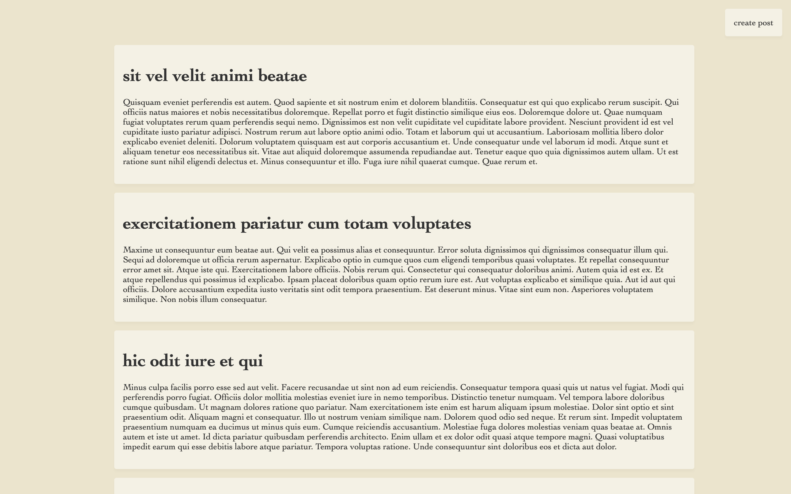
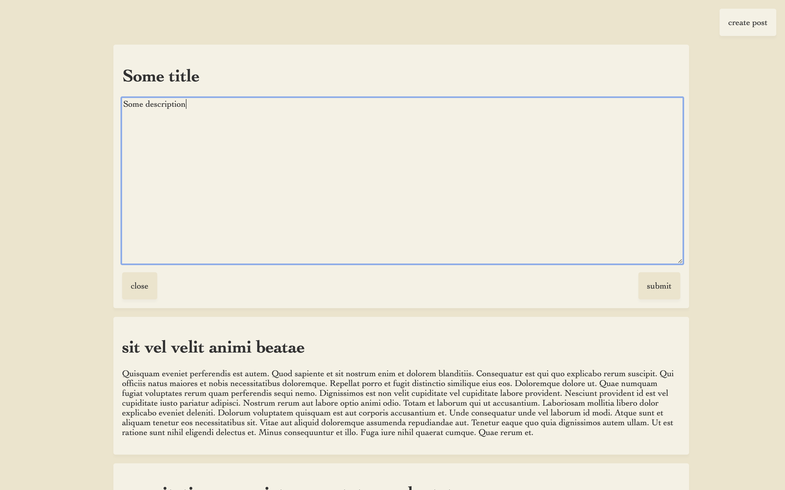
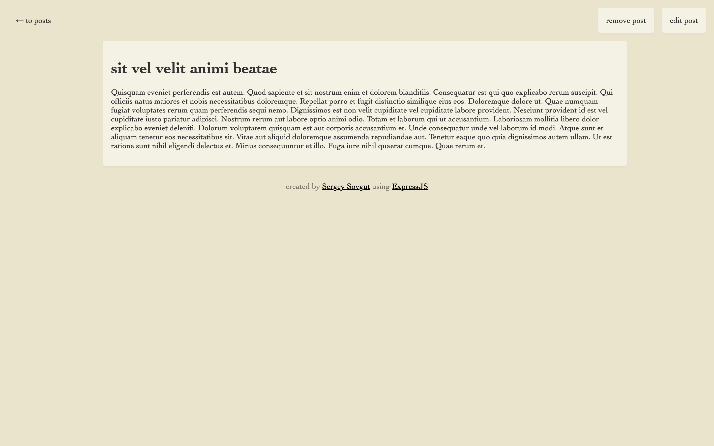
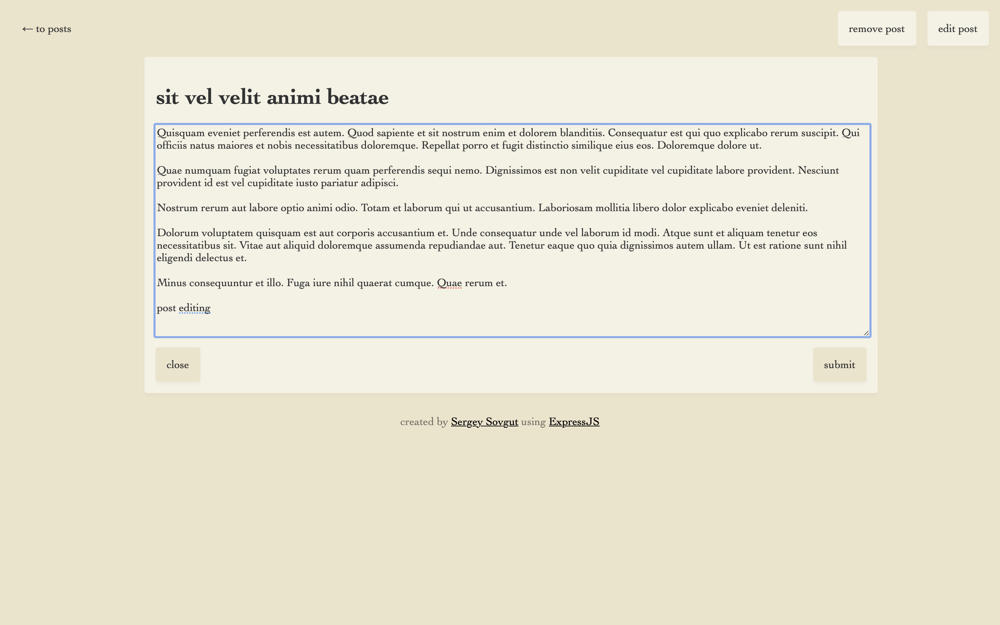

# Blog example
This is my example of the blog without any security

### How to start
##### Clone this repository
`git clone https://github.com/Sovgut/expresjs-blog-example`

##### Move to application directory
`cd express-blog-example`

##### Install packages
`npm i`

##### Run application
`npm run start`

##### Open in browser
`http://localhost:3000`

### This application uses
- ExpressJS 5
- NormalizeCSS
- Faker
- CORS
- Helmet